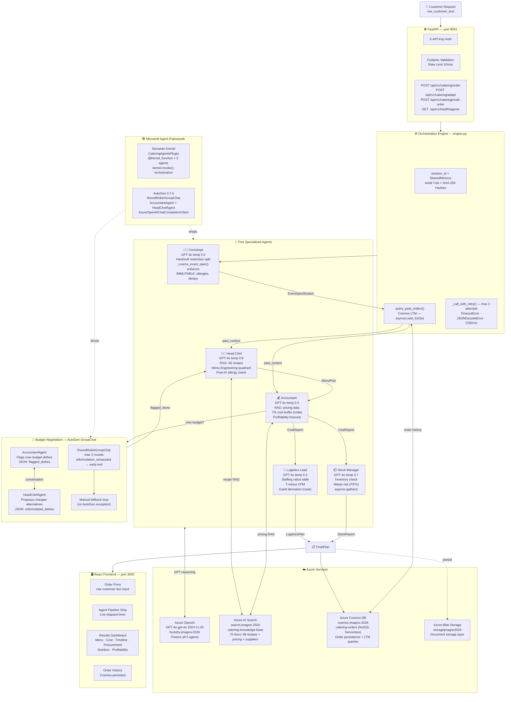
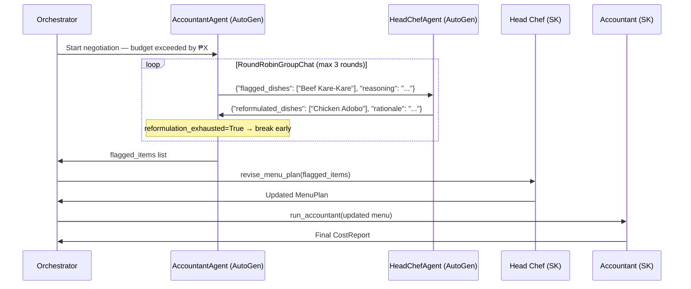
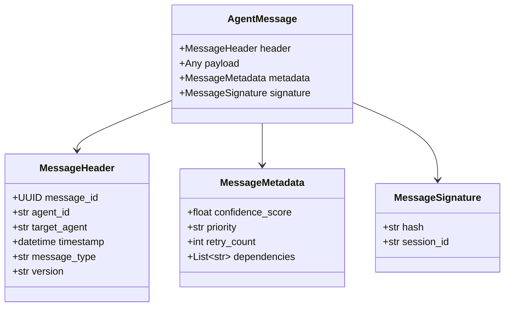

# Smart Catering Agent — Architecture

> **Principle:** Hard constraints live in code, always. Soft judgments belong to GPT. Math belongs to code. Every GPT call degrades gracefully.

---

## Full Pipeline

---

## Negotiation Detail

---

## Agent Communication Protocol

---

## Azure Services Map

| Service | Resource | Role | Status |
|---|---|---|---|
| Azure OpenAI GPT-4o | foundry-jmagno-2026 | All 5 agent reasoning calls | ✅ Active |
| Azure AI Search | search-jmagno-2026 · catering-knowledge-base | RAG — 70 documents (68 recipes + pricing + suppliers) | ✅ Active |
| Azure Cosmos DB | cosmos-jmagno-2026 · catering-orders | Order persistence + long-term memory queries | ✅ Active |
| Azure Blob Storage | storagejmagno2026 | Document storage layer | ✅ Active |

---

## Key Architecture Invariants

| Rule | Enforcement |
|---|---|
| Allergies never violated | `_IMMUTABLE_KEYS` in SharedMemory + post-AI code check |
| Budget status never manipulated | Deterministic math only — GPT never touches cost calc |
| Every GPT call degrades gracefully | `_call_with_retry()` + static fallback on all 5 agents |
| AutoGen never breaks the pipeline | `try/except` fallback to manual negotiation loop |
| Dietary flags immutable mid-pipeline | SharedMemory rejects writes to protected keys |
