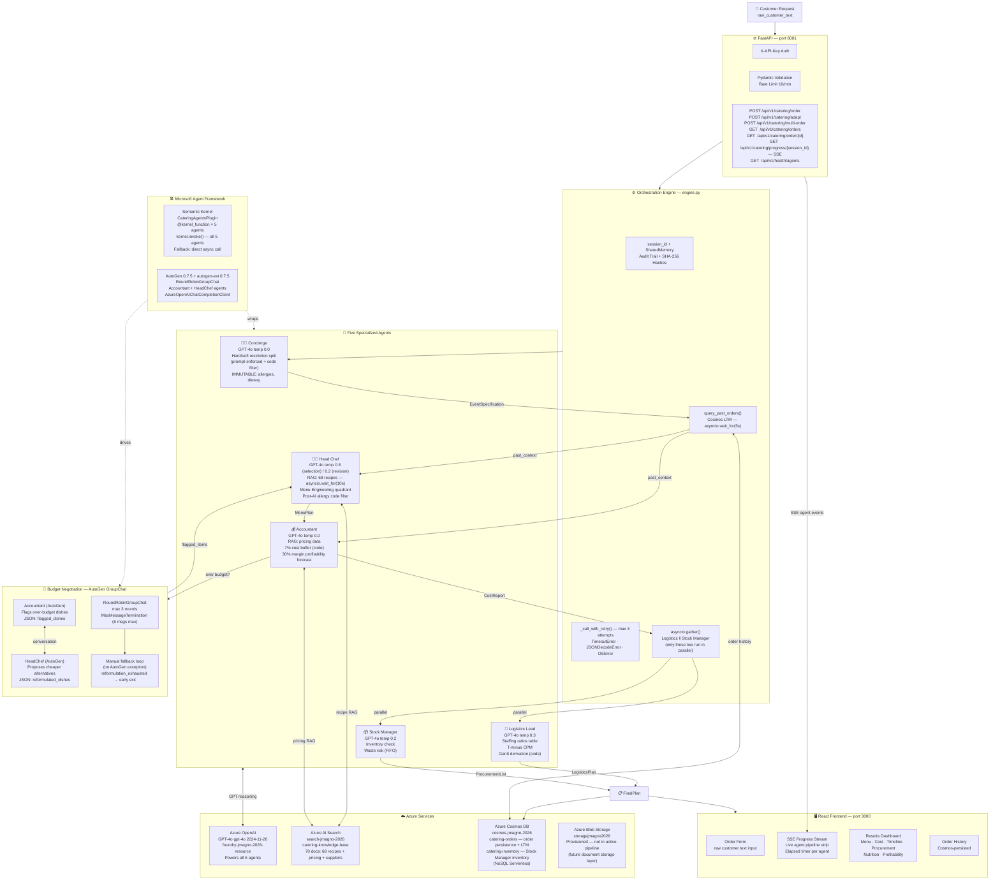
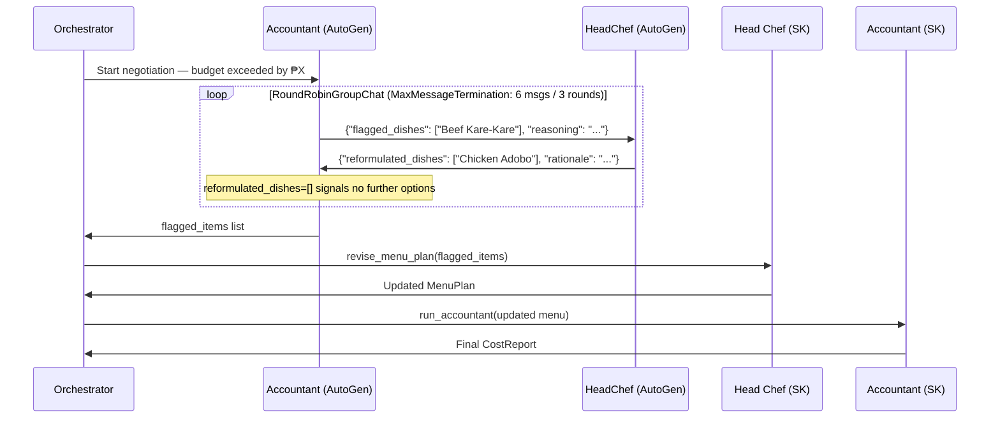
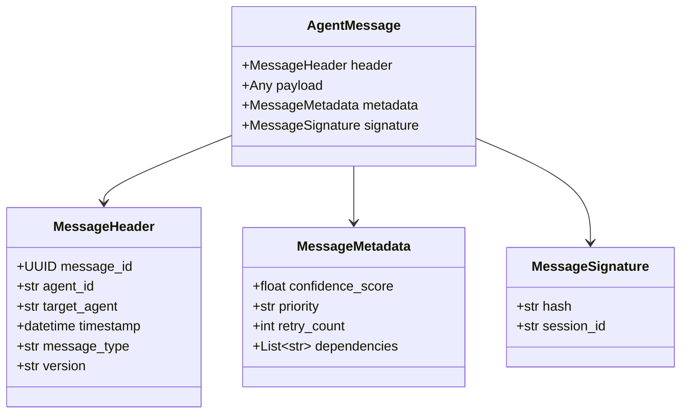

# Smart Catering Agent — Architecture

> **Principle:** Hard constraints live in code, always. Soft judgments belong to GPT. Math belongs to code. Every GPT call degrades gracefully.

---

## Full Pipeline



---

## Execution Sequence

The pipeline is **sequential** except for the final two agents:

```
Customer text
    │
    ▼
[1] Concierge          → parses raw text → EventSpecification
    │
    ▼ (query_past_orders — asyncio.wait_for 5s)
[2] Head Chef          → recipe RAG (asyncio.wait_for 10s) → MenuPlan
    │
    ▼
[3] Accountant         → pricing RAG → CostReport
    │
    ├── if over budget → AutoGen GroupChat negotiation (max 3 rounds)
    │       └── Accountant ↔ HeadChef agents → flagged_items
    │               └── Head Chef revises → Accountant re-prices
    │               └── (manual loop fallback if AutoGen raises exception
    │                    — manual loop checks reformulation_exhausted flag)
    │
    ▼ asyncio.gather() — only these two run in parallel
[4] Logistics Lead  ‖  [5] Stock Manager
    │                       │
    ▼                       ▼
LogisticsPlan          ProcurementList
    │                       │
    └───────────┬───────────┘
                ▼
           FinalPlan → Cosmos DB + React Frontend
```

---

## Negotiation Detail



---

## Agent Communication Protocol



Every agent-to-agent message is wrapped in this typed `AgentMessage` envelope. The `signature.hash` is a SHA-256 digest of the payload, computed in code — never by GPT.

---

## Azure Services Map

| Service | Resource | Role | Pipeline Status |
|---|---|---|---|
| Azure OpenAI GPT-4o | foundry-jmagno-2026-resource | All 5 agent reasoning calls | ✅ Active |
| Azure AI Search | search-jmagno-2026 · catering-knowledge-base | RAG — 70 documents (68 recipes + pricing + suppliers) | ✅ Active |
| Azure Cosmos DB | cosmos-jmagno-2026 · `catering-orders` + `catering-inventory` | Order persistence + long-term memory + Stock Manager inventory | ✅ Active |
| Azure Blob Storage | storagejmagno2026 | Provisioned — reserved for future document storage layer | ⚙️ Provisioned, not in active pipeline |

---

## API Endpoints

| Method | Path | Description | Auth |
|---|---|---|---|
| `POST` | `/api/v1/catering/order` | Submit a new catering order — runs full 5-agent pipeline | X-API-Key |
| `POST` | `/api/v1/catering/adapt` | Adapt an existing order — re-runs only impacted agents | X-API-Key |
| `POST` | `/api/v1/catering/multi-order` | Run up to 3 orders + optimize shared procurement | X-API-Key |
| `GET` | `/api/v1/catering/orders` | List recent orders from Cosmos DB (order history) | X-API-Key |
| `GET` | `/api/v1/catering/order/{order_id}` | Retrieve a single order by ID | X-API-Key |
| `GET` | `/api/v1/catering/progress/{session_id}` | **SSE stream** — live agent pipeline progress events | X-API-Key |
| `GET` | `/api/v1/health/agents` | Check connectivity to all Azure services (30s cache) | None |

### Adapt Endpoint — Selective Agent Re-run Logic

Which agents re-run on an adaptation is determined by **code**, not GPT:

| Change Type | Agents Re-run |
|---|---|
| `DATE_CHANGE`, `EVENT_TIME_CHANGE`, `LOCATION_CHANGE`, `NOTES_CHANGE` | Logistics Lead + Stock Manager only (lightweight path) |
| `GUEST_COUNT_CHANGE`, `DIETARY_ADDITION`, `ALLERGY_ADDITION` | Head Chef → Accountant → Logistics → Stock Manager |
| `BUDGET_CHANGE` | Accountant → (negotiation if needed) → Logistics → Stock Manager |

---

## Key Architecture Invariants

| Rule | Enforcement |
|---|---|
| Allergies never violated | `_IMMUTABLE_KEYS` in SharedMemory + post-AI code check in Head Chef |
| Budget status never manipulated | Deterministic math only — GPT never touches cost calculation |
| Every GPT call degrades gracefully | `_call_with_retry()` + static fallback on all 5 agents |
| Every RAG call degrades gracefully | `asyncio.wait_for(10s)` on Azure AI Search → local `recipes.json` fallback |
| AutoGen never breaks the pipeline | Full `RoundRobinGroupChat` active; `try/except` fallback to manual loop |
| Dietary flags immutable mid-pipeline | SharedMemory rejects writes to protected keys; checked after every agent handoff |
| LTM query never blocks the pipeline | `asyncio.wait_for(5s)` on `query_past_orders()` — empty context on timeout |

---

## Tech Stack

| Layer | Technology | Version | Role |
|---|---|---|---|
| **AI Reasoning** | Azure OpenAI GPT-4o | 2024-11-20 | All 5 agents' reasoning, judgment, and rationale |
| **Agent Framework** | Semantic Kernel | 1.41.2 | `CateringAgentsPlugin` + `@kernel_function` × 5 — all 5 agents invoked via `kernel.invoke()`; `Kernel` initialized at startup with `AzureChatCompletion` service |
| **Multi-Agent Chat** | AutoGen AgentChat | 0.7.5 | `RoundRobinGroupChat` — live budget negotiation between `Accountant` + `HeadChef` agents |
| **AutoGen Model Client** | autogen-ext | 0.7.5 | `AzureOpenAIChatCompletionClient` — connects AutoGen agents to Azure OpenAI |
| **RAG** | Azure AI Search | REST API | 70-document index — recipe selection + ingredient pricing; `asyncio.wait_for(10s)` timeout with local fallback |
| **Persistence & Memory** | Azure Cosmos DB | NoSQL Serverless | Order storage + long-term memory (`query_past_orders()` — `asyncio.wait_for(5s)`) |
| **API Layer** | FastAPI + Uvicorn | 0.135.3 / 0.44.0 | REST endpoints + SSE streaming, X-API-Key auth, rate limiting (10/min via SlowAPI) |
| **Data Validation** | Pydantic | 2.x | Schema enforcement on all agent messages + API input |
| **Backend Language** | Python | 3.12 | Async pipeline via `asyncio`; ~20s startup for SK + AutoGen import on Windows |
| **Frontend** | React | 19 | Neumorphic UI — order form, live SSE pipeline strip, results dashboard, order history |
| **Agent Protocol** | Custom JSON + SHA-256 | — | Typed `AgentMessage` envelope on every agent-to-agent message |

---

## Scalability

### Current State (Hackathon Demo)
The system runs locally with all AI and data services hosted on Azure cloud:
- **Compute**: localhost:8001 (backend) + localhost:3001 (frontend via proxy)
- **AI Services**: Azure OpenAI (cloud), Azure AI Search (cloud), Azure Cosmos DB (cloud)
- **Startup**: ~20s for Semantic Kernel + AutoGen import on Windows
- **Throughput**: Azure free tier — 60-180s per pipeline request (5 sequential GPT-4o calls)
- **Concurrency**: Single user, sequential requests (FastAPI async handles one pipeline per request)

### Production Scalability Path

```mermaid
flowchart LR
    subgraph Now["🏠 Demo — Local Compute"]
        L1["FastAPI localhost:8001\nSingle instance"]
        L2["Azure free tier\nShared capacity"]
    end

    subgraph Near["🚀 Near-Term — App Service"]
        N1["Azure App Service\nor Container Apps\nHorizontal scale-out"]
        N2["Azure OpenAI\nProvisioned Throughput\n8-20s per request"]
        N3["Cosmos DB\nProvisioned RU/s\nConsistent low-latency reads"]
    end

    subgraph Scale["📈 At Scale — Enterprise"]
        S1["Azure API Management\nRate limiting, auth, versioning"]
        S2["Azure Service Bus\nAsync event-driven pipeline\nDecouple agents"]
        S3["Azure Container Apps\nAuto-scale to zero\nPer-agent microservices"]
        S4["Azure AI Search\nSemantic ranker\nVector search + hybrid"]
    end

    Now --> Near --> Scale
```



| Bottleneck | Current Limitation | Production Solution |
|---|---|---|
| **Compute** | localhost single process | Azure App Service / Container Apps — horizontal scale-out, auto-scale to zero |
| **GPT latency** | 20-120s (free tier shared) | Provisioned Throughput Unit (PTU) — guaranteed 8-20s per pipeline |
| **Agent parallelism** | Logistics + Stock Manager parallel; others sequential | Azure Service Bus event-driven pipeline — all agents decouple and run as independent microservices |
| **Knowledge base** | Static 70-doc index | Azure AI Search vector search + semantic ranker — dynamic recipe discovery beyond fixed KB |
| **Inventory** | Mock file fallback | Live Cosmos DB `catering-inventory` writes — real-time stock subtraction after each order |
| **Concurrency** | One order at a time (FastAPI async) | Azure Container Apps auto-scaling — N parallel pipelines without code changes |
| **Auth & routing** | API key per client | Azure API Management — JWT, subscription plans, usage analytics |
| **Multi-tenant** | Single deployment | Per-tenant Cosmos containers, per-tenant AI Search indexes |

### Why the Architecture Scales
1. **Stateless agents** — each agent receives inputs, returns outputs, holds no state. Trivially horizontally scalable.
2. **Async pipeline** — `asyncio.gather()` already runs Logistics + Stock Manager concurrently. Extending to all 5 agents requires only event queue integration.
3. **Azure-native services** — OpenAI, Cosmos, AI Search all auto-scale independently of compute.
4. **Structured message protocol** — `AgentMessage` JSON schema enables any transport layer (HTTP, Service Bus, gRPC) without changing agent logic.
5. **Graceful degradation at every layer** — `_call_with_retry()` + static fallbacks mean partial failures don't cascade.

---

## Deployment Status

| Component | Current | Production Path |
|---|---|---|
| Backend API | `localhost:8001` (FastAPI + Uvicorn) | Azure App Service / Container Apps |
| Frontend | `localhost:3000` (React) | Azure Static Web Apps |
| Azure OpenAI | ✅ Cloud — foundry-jmagno-2026-resource | Same, upgrade to PTU |
| Azure AI Search | ✅ Cloud — search-jmagno-2026 | Same, add semantic ranker |
| Azure Cosmos DB | ✅ Cloud — cosmos-jmagno-2026 | Same, add provisioned RU/s |
| Azure Blob | ⚙️ Provisioned — storagejmagno2026 | Activate for document storage layer |

> **Note:** Local execution was necessary due to Azure free subscription VM quota constraints (zero App Service quota available). All AI, storage, and search services are live Azure cloud resources. The compute layer is the only local component.
